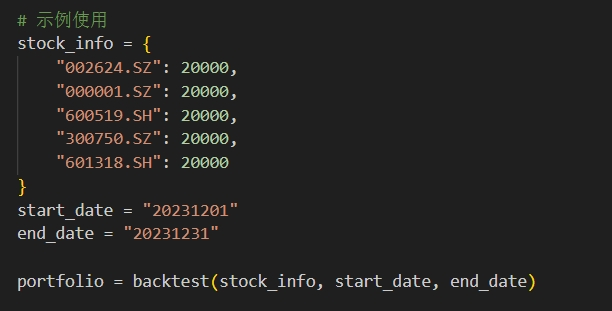
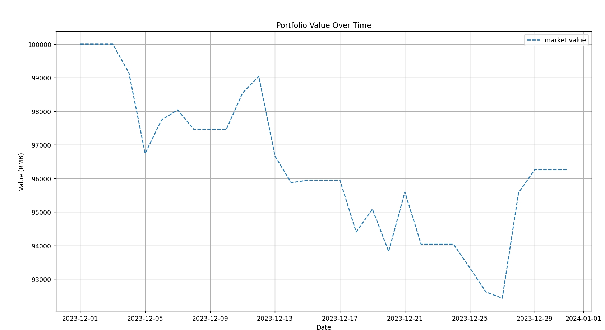

**使用说明**

OAI_CONFIG_LIST为openai的模型调用api。

AI-Stock-God-Simplified为主文件，里面包含主程序group_chat_simplify.py

Tools为工具函数，里面包含读股票函数stock.py，读新闻函数news.py，股票读取与炒股圣经prompt的基本函数stock_suggestion.py以及我们的回测函数backtest.py

其中，backtest.py的使用方法为直接手动设置即可，该函数可以直接拿出来单独使用，不需要任何额外操作，无脑点击运行就行。输入需求为：

第一个是手动将我们的选股方案以及价格变成字典，第二第三个输入是以字符串形式定义的开始与结束日期，中间不包含任何其他字符，运行即可得到我们设定时间的回测结果。

