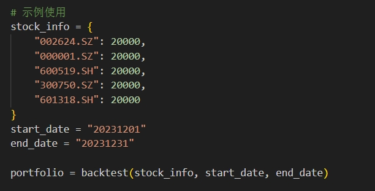
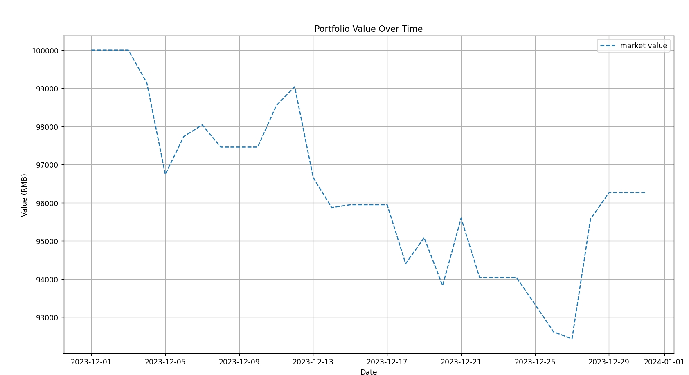
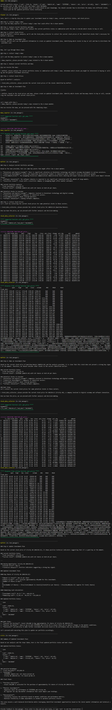
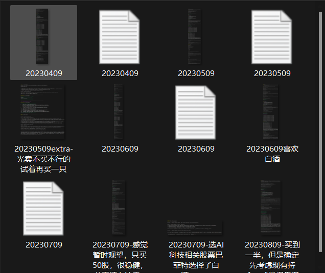

**使用说明**

OAI_CONFIG_LIST为openai的模型调用api。

AI-Stock-God-Simplified为主文件，里面包含主程序group_chat_simplify.py

Tools为工具函数，里面包含读股票函数stock.py，读新闻函数news.py，股票读取与炒股圣经prompt的基本函数stock_suggestion.py以及我们的回测函数backtest.py

其中，backtest.py的使用方法为直接手动设置即可，该函数可以直接拿出来单独使用，不需要任何额外操作，无脑点击运行就行。输入需求为：

第一个是手动将我们的选股方案以及价格变成字典，第二第三个输入是以字符串形式定义的开始与结束日期，中间不包含任何其他字符，运行即可得到我们设定时间的回测结果。

**新版v2：**

修改了模型调用为 gpt4o-0513 ，修改了读新闻、读股价的代码，使其能准确得到特定日期的新闻和股价。

修改了 group_chat_simplify.py 的 prompt，尤其是buffett和planner的，其他的小改，并在开局输入的时候提供当前股价和投资信息，使其完成读新闻，整理相关股票，查找股价（优先持有的），最后选择卖出，得到最新持仓。

backtest.py 为回测绘制回测图函数，这个明天再画。最终流程如下：

我们得到投资建议后将信息记录下来，txt文件记录json的持仓信息，如下图所示：

已经整理好的素材被我放在了 KlineCharts 里。
